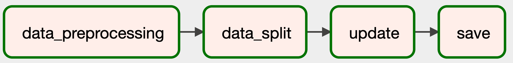
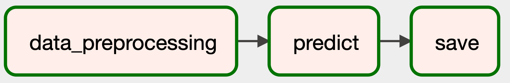

# MLOps-airflow

## Dags Architecture

### model_training


### model_update


### model_predict


### model_evaluate


## How to use

### Install airflow and modify `airflow.cfg`

```bash
# After install airflow
cd $AIRFLOW_HOME

# Clone the repo
git clone https://github.com/kevin1010607/MLOps-airflow.git

# Modify airflow config
vim airflow.cfg
# Line 4: dags_folder = $AIRFLOW_HOME/MLOps-airflow/src
# Line 66: load_examples = False
# Line 113: enable_xcom_pickling = True
```

### Run airflow

```bash
# Run webserver
airflow webserver -p 8080

# Create another terminal and run scheduler
airflow scheduler
```

### Run dags and view the logs

1. Open 127.0.0.1:8080
2. Trigger DAG
3. Logs can be found in the `$AIRFLOW_HOME/logs`

### API
# Modify airflow config
# auth_backends = airflow.api.auth.backend.session,airflow.api.auth.backend.basic_auth